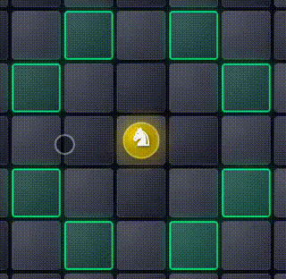
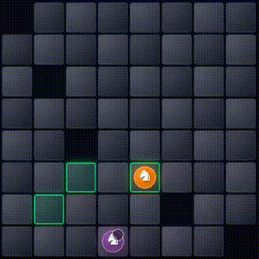
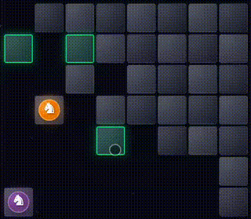
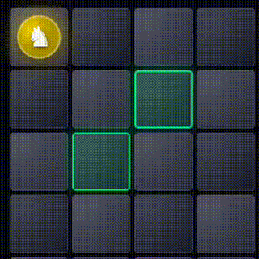

# Pferdeäppel 🐴♟️

A turn-based chess knight strategy game where two players compete to outmaneuver each other on a shrinking board.

<p align="center">
  
  
  
</p>

## 📥 Download

[](https://github.com/dionjoshualobo/Pferdeappel/releases/latest)

**[➡️ Which APK should I download?](#-which-apk-to-download)**

---

## 🎮 How to Play

### Objective
Capture your opponent's knight or trap them so they have no valid moves!

### Setup
- **Player 1** starts at the **top-left** corner
- **Player 2** starts at the **bottom-right** corner
- Player 1 always moves first

### Movement
Each knight moves in an **L-shape**, just like in chess:
- 2 squares in one direction + 1 square perpendicular, OR
- 1 square in one direction + 2 squares perpendicular

### The Abyss
When you move your knight, the tile you **leave behind falls into the abyss** and becomes void. You cannot land on void tiles!

<p align="center">
  
</p>

---

## 📜 Rules

### Win Conditions
1. **Capture** - Land on your opponent's tile to capture them
2. **Trap** - Leave your opponent with no valid moves

### Special Rules
- **4×4 Board Only**: Player 2 cannot capture on their first move (balances the smaller board)
- **Tie Condition**: If only 2 tiles remain (one under each player), the game ends in a **tie**

### Game Modes
- **Player vs Player** - Play against a friend locally
- **Player vs Computer** - Challenge the AI with 4 difficulty levels:
  - 🟢 **Easy** - Random moves with basic trap avoidance
  - 🟡 **Medium** - Heuristic evaluation with lookahead
  - 🟠 **Hard** - Minimax algorithm with 4-ply depth
  - 🔴 **Impossible** - Deep Negamax search (disabled on 4×4*)

> *On 4×4 boards, "Impossible" is disabled because Player 2 has a mathematically forced win.

---

## 📱 Which APK to Download?

| APK Type | Best For | Size |
|----------|----------|------|
| **arm64-v8a** | Most modern phones (2016+) | ~17 MB |
| **armeabi-v7a** | Older phones (pre-2016) | ~14 MB |
| **x86_64** | Emulators, Chromebooks | ~18 MB |
| **universal** | All devices (if unsure) | ~44 MB |

### How to check your phone's architecture:
1. Go to **Settings → About Phone**
2. Look for **CPU** or **Processor** info
3. If it says **arm64** or **aarch64** → Download **arm64-v8a**
4. If it says **arm** or **armeabi** → Download **armeabi-v7a**
5. **Not sure?** → Download **universal** (works on all devices)

---

## 🛠️ Building from Source

### Prerequisites
- [Flutter SDK](https://docs.flutter.dev/get-started/install) (^3.10.4)
- Android Studio or VS Code with Flutter extension

### Steps
```bash
# Clone the repository
git clone https://github.com/dionjoshualobo/Pferdeappel.git
cd Pferdeappel

# Get dependencies
flutter pub get

# Run on connected device
flutter run

# Build release APK
flutter build apk --release --split-per-abi
```

---

## 🤝 Contributing

Contributions are welcome! Here's how you can help:

### Reporting Bugs
1. Check if the issue already exists in [Issues](https://github.com/dionjoshualobo/Pferdeappel/issues)
2. If not, create a new issue with:
   - Device model and Android version
   - Steps to reproduce
   - Expected vs actual behavior
   - Screenshots if applicable

### Suggesting Features
Open an issue with the `enhancement` label describing:
- The feature you'd like to see
- Why it would be useful
- Any implementation ideas

### Submitting Code
1. Fork the repository
2. Create a feature branch: `git checkout -b feat/your-feature`
3. Make your changes
4. Run `flutter analyze` and fix any issues
5. Commit with clear messages: `git commit -m "feat: Add your feature"`
6. Push to your fork: `git push origin feat/your-feature`
7. Open a Pull Request

### Code Style
- Follow [Effective Dart](https://dart.dev/guides/language/effective-dart) guidelines
- Use meaningful variable and function names
- Add comments for complex logic
- Keep functions small and focused

---

## 📄 License

This project is open source and available under the MIT License.

---

## 🙏 Acknowledgments

- Game concept inspired by the traditional "Pferdeäppel" board game
- Built with [Flutter](https://flutter.dev/) and [Riverpod](https://riverpod.dev/)

---

<p align="center">
  Made with ❤️ by <a href="https://github.com/dionjoshualobo">Dion Joshua Lobo</a>
</p>
